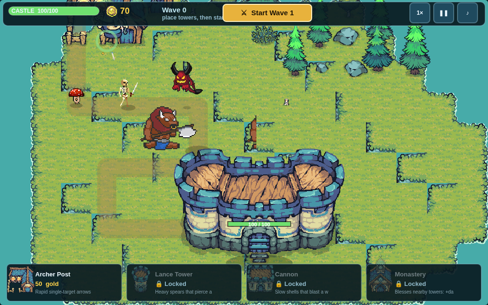

# ⚔️ Tiny Siege

**A tower-defense roguelite built with the [Tiny Swords](https://www.silverhaws.net/) asset pack.**

Defend your castle on a little grass island from endless, procedurally-generated waves of
tiny invaders. Build and upgrade towers, then pick from random **boons** between waves to
stack into a powerful — or delightfully cursed — run. How many waves can you survive?



## How to play

- Enemies march from the top of the island along the dirt path toward your castle.
- Pick a tower in the bottom bar (or press `1`–`4`), then click a green build spot to place it.
- Click a built tower to open its panel: **upgrade individual stats** (Damage, Fire Rate, Range —
  the Monastery upgrades its Blessing and Aura) or **Sell** it. A range ring shows its coverage.
- Hit **Start Wave** (or press `Space`) when you're ready.
- Clear the wave to earn gold, then choose **1 of 3 random boons** for the rest of the run.
- If the castle's health hits zero, the run ends. Your best wave count is saved locally.

### Towers

| Tower        | Cost | Role                                                        |
| ------------ | ---- | ----------------------------------------------------------- |
| Archer Post  | 50   | Rapid single-target arrows. Your workhorse.                 |
| Lance Tower  | 90   | Heavy spears that pierce a line of foes.                    |
| Cannon       | 120  | Slow shells that blast a whole cluster (splash damage).     |
| Monastery    | 100  | Blesses nearby towers with +damage and +attack speed.       |

New towers unlock through boons as you get deeper.

### Enemies

- **Pawns, Archers, Warriors, Lancers, Healers** — the classic Tiny Swords units, in four enemy colors.
- **Mushroom** — a fast little runner (from wave 3).
- **Mantis** — a speedy bug that darts down the path (from wave 3).
- **Beetle** — a slow, sturdy bug (from wave 4).
- **Skeleton** — a melee swordsman, in white or yellow (from wave 5).
- **Forest Sprite** — a small hopping floater (from wave 6).
- **Flying Demon** — a hovering bat that weaves over your defenses (from wave 7).
- **Minotaur** — the **boss**, every 5th wave (double every 15th, with healer escorts).

The map is a large island with a long winding path and **marked stone pads** — towers can only be
built on those pads.

### Boons (the roguelite layer)

Between waves you pick one of three random boons: extra gold, stronger towers, new tower
unlocks, castle fortification, and special or *risky* effects (like the cursed gold that pays
you more but hardens every enemy). Boons are weighted by rarity (common / rare / epic) and many
can stack, so no two runs feel the same.

### Controls

| Input             | Action                          |
| ----------------- | ------------------------------- |
| `1` `2` `3` `4`   | Select tower to build           |
| Click             | Build / select tower / confirm  |
| Right-click / `Esc`| Cancel placement / deselect     |
| `Space`           | Start the next wave             |
| `P`               | Pause                           |
| `F`               | Cycle game speed (1× / 2× / 3×) |
| `M`               | Mute / unmute                   |

> **Attract mode:** open the page with `?demo` to watch the game play itself, or `?demo&ff=60&seed=1`
> to fast-forward a deterministic run.

## Run it locally

```bash
npm install
npm run dev        # start the dev server (http://localhost:5173)
```

Other scripts:

```bash
npm run build      # typecheck + production build to dist/
npm run preview    # serve the production build
npm run typecheck  # tsc only
npm run assets     # regenerate the processed asset tree (needs Python 3 + PIL + numpy)
```

## Asset pipeline

The game ships with a **pre-processed** asset tree in `public/assets/` plus a `manifest.json`,
so the browser never has to slice sprite sheets at runtime. If you change the raw art, regenerate
with the pipeline:

```bash
pip install pillow numpy
npm run assets
```

`tools/build_assets.py` reads the raw `Tiny Swords (Free Pack)/` and `enemies/` art and:

- slices variable-width horizontal sprite sheets into normalized frames (bottom-aligned,
  centered) so every unit anchors at its feet;
- extracts the 64px autotile grass tiles;
- normalizes static art (buildings, UI, decorations) to content bboxes;
- emits `manifest.json` describing every asset.

## Hosting on GitHub Pages

A GitHub Actions workflow (`.github/workflows/deploy.yml`) builds the project and deploys
`dist/` to GitHub Pages on every push to `main`. Because the Vite config uses a relative base
(`base: './'`), the game runs correctly from any `/user/repo/` path.

Enable **Settings → Pages → Source: GitHub Actions** and push to `main`.

## Credits

- **Tiny Swords (Free Pack)** — Silverhaws (the base units, buildings, tiles, UI, and FX).
- Added enemy packs: *Skeletons Free Pack*, *Forest Monsters (Mushroom)*, *Flying Demon 2D
  Pixel Art*, and the *Minotaur* sprite sheet.
- Built with [Vite](https://vitejs.dev/) + TypeScript and a hand-rolled Canvas 2D engine.
